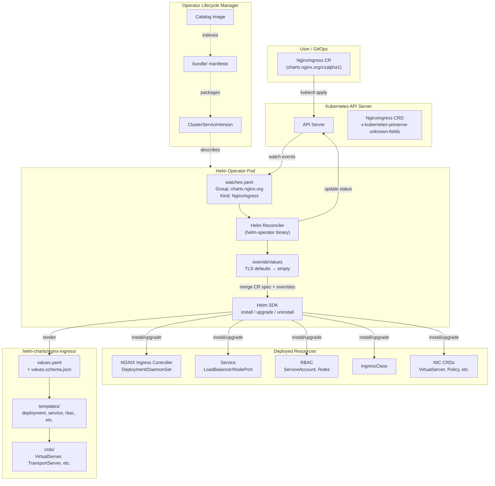

# Architecture and Structure

## Architecture Diagram

## Repository Layout

| Path | Purpose |
|------|---------|
| `watches.yaml` | Core operator config — maps CRD to Helm chart with default overrides |
| `Dockerfile` | Operator image — copies watches.yaml + helm-charts onto helm-operator base |
| `helm-charts/nginx-ingress/` | Embedded Helm chart (source of truth for all deployable config) |
| `helm-charts/nginx-ingress/values.yaml` | Default Helm values |
| `helm-charts/nginx-ingress/values.schema.json` | JSON Schema validation for chart values |
| `helm-charts/nginx-ingress/templates/` | Kubernetes resource templates |
| `helm-charts/nginx-ingress/crds/` | NIC CRDs (VirtualServer, TransportServer, Policy, etc.) |
| `config/crd/` | Operator's own CRD (NginxIngress) base + kustomize patches |
| `config/rbac/` | Operator RBAC (broad permissions to manage NIC resources) |
| `config/manager/` | Operator Deployment manifest |
| `config/default/` | Default kustomize overlay (namespace, kube-rbac-proxy patch) |
| `config/manifests/` | Input for `operator-sdk generate bundle` |
| `bundle/` | Generated OLM bundle (CSV, CRD, metadata, scorecard) |
| `examples/` | Sample NginxIngress CRs (OSS minimal, Plus minimal) |
| `resources/` | Supporting manifests (SCC, IngressClass, independent RBAC) |
| `scripts/` | Automation (OpenShift version updates) |
| `docs/` | Installation, upgrade, OpenShift documentation |
| `tests/` | Test CR manifests |

## Reconciliation Flow

1. User creates/updates a `NginxIngress` CR in a namespace
2. The helm-operator watches for `charts.nginx.org/v1alpha1/NginxIngress` events (defined in `watches.yaml`)
3. The reconciler merges CR `.spec` values with `overrideValues` from `watches.yaml`
4. TLS cert/key fields are forced to empty strings (security: users must provide secrets explicitly)
5. The merged values are passed to Helm SDK
6. Helm renders `helm-charts/nginx-ingress/` templates with the merged values
7. Helm performs install (new CR), upgrade (updated CR), or uninstall (deleted CR)
8. Deployed resources: NIC Deployment/DaemonSet, Service, RBAC, IngressClass, NIC CRDs
9. Operator updates CR `.status` with reconciliation result

## Layer Crossing Rules

- **watches.yaml must NOT contain application logic** — It only maps CRD to chart and sets security overrides
- **Helm chart must NOT reference operator internals** — The chart is a standalone Helm chart
- **CRD schema must NOT validate Helm values** — Uses `x-kubernetes-preserve-unknown-fields: true` for pass-through
- **Bundle must NOT be hand-edited** — Always regenerated via `make bundle`
- **RBAC must NOT be narrower than NIC requirements** — The operator must manage all resources NIC needs

## Key Design Decisions

| Decision | Rationale |
|----------|-----------|
| `x-kubernetes-preserve-unknown-fields` | Allows chart values to evolve without CRD schema changes |
| TLS overrides to empty | Forces explicit secret configuration — security by default |
| Embedded chart (not chart reference) | Version coupling between operator and chart is intentional |
| No Go code | Reduces maintenance burden; all logic is declarative |
| Broad RBAC | NIC manages many resource types; operator must have all permissions |
