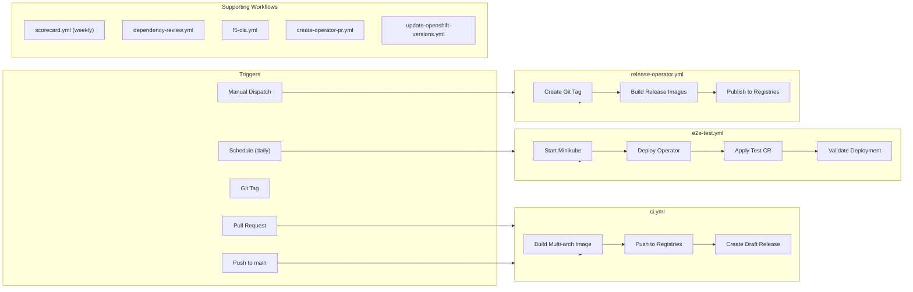

# CI/CD and Release

## Pipeline Architecture

## Key Workflows

| Workflow | Trigger | Purpose |
|----------|---------|---------|
| `ci.yml` | Push to main, PRs | Build multi-arch images, push to registries, create draft release |
| `e2e-test.yml` | Daily schedule | End-to-end operator deployment test on Minikube |
| `release-operator.yml` | Manual dispatch | Create git tag and publish release images |
| `scorecard.yml` | Weekly schedule | OpenSSF security scorecard analysis |
| `dependency-review.yml` | PRs | Review dependency changes for vulnerabilities |
| `f5-cla.yml` | PRs | Verify contributor license agreement |
| `create-operator-pr.yml` | External trigger | Auto-create PRs when upstream chart updates |
| `update-openshift-versions.yml` | Manual/schedule | Update supported OpenShift version range |
| `dependabot-auto-merge.yml` | Renovate PRs | Auto-merge dependency update PRs |
| `stale.yml` | Schedule | Mark and close stale issues |

## Build System

### Image Variants

| Image | Registry | Purpose |
|-------|----------|---------|
| `nginx/nginx-ingress-operator` | Docker Hub | Primary operator image |
| `ghcr.io/nginx/nginx-ingress-operator` | GitHub Container Registry | Alternative registry |
| `quay.io/nginx/nginx-ingress-operator` | Quay.io | Red Hat/OpenShift ecosystem |
| `*-bundle` | All registries | OLM bundle image |
| `*-catalog` | All registries | OLM catalog image |

### Build Targets

| Target | What it produces |
|--------|-----------------|
| `make docker-build` | Single-arch operator image |
| `make docker-buildx` | Multi-arch operator image (amd64 + arm64) |
| `make bundle-build` | OLM bundle image |
| `make catalog-build` | OLM catalog image |

### Key Build Arguments

| Variable | Default | Purpose |
|----------|---------|---------|
| `VERSION` | `3.6.0` | Operator version |
| `IMG` | `quay.io/nginx/nginx-ingress-operator:3.6.0` | Operator image tag |
| `PLATFORMS` | `linux/arm64,linux/amd64` | Target architectures |
| `OPERATOR_SDK_VERSION` | `v1.42.2` | SDK version for tooling |
| `KRP_IMAGE_VERSION` | `v0.22.0` | kube-rbac-proxy version |

## Release Process

### Steps (Manual Dispatch)

1. Maintainer triggers `release-operator.yml` with version number
2. Workflow creates git tag (`v{VERSION}`)
3. CI triggered by tag push builds multi-arch images
4. Images pushed to Docker Hub, GHCR, and Quay.io
5. GitHub Release created (draft → published)
6. OLM bundle submitted to community-operators (separate process)

### OLM Publishing

1. Run `make bundle` with correct VERSION
2. Build and push bundle image: `make bundle-build bundle-push`
3. Build and push catalog image: `make catalog-build catalog-push`
4. Submit PR to `community-operators` repository with bundle contents
5. Red Hat certification process (separate from community)

### Version Tracking

| File | What to update |
|------|---------------|
| `Makefile` (`VERSION`) | Primary version source |
| `Makefile` (`REPLACES`) | OLM upgrade path (previous version) |
| `config/manager/manager.yaml` | Image tag in deployment |
| `README.md` | Version compatibility matrix |
| `helm-charts/nginx-ingress/Chart.yaml` | Chart and app versions |

## Dependency Management

Managed by Renovate (`renovate.json`):
- Docker base images (helm-operator, kube-rbac-proxy)
- GitHub Actions (pinned to SHA)
- Kustomize, operator-sdk, opm tool versions
- Helm chart dependencies

## Gotchas

- **Actions pinned to SHA** — Never reference actions by tag; always use full commit SHA
- **Multi-arch builds require QEMU** — CI sets up QEMU for arm64 cross-compilation
- **Draft releases on main push** — Every push to main creates/updates a draft release
- **E2E runs on schedule only** — Not triggered per-PR; rely on Tier 1-3 validation for PRs
- **Bundle images must be pushed before catalog** — Catalog references bundle by digest
- **Red Hat labels in bundle.Dockerfile** — Required for OpenShift certification
- **`OPENSHIFT_VERSION` affects certification** — Must match actual supported versions
